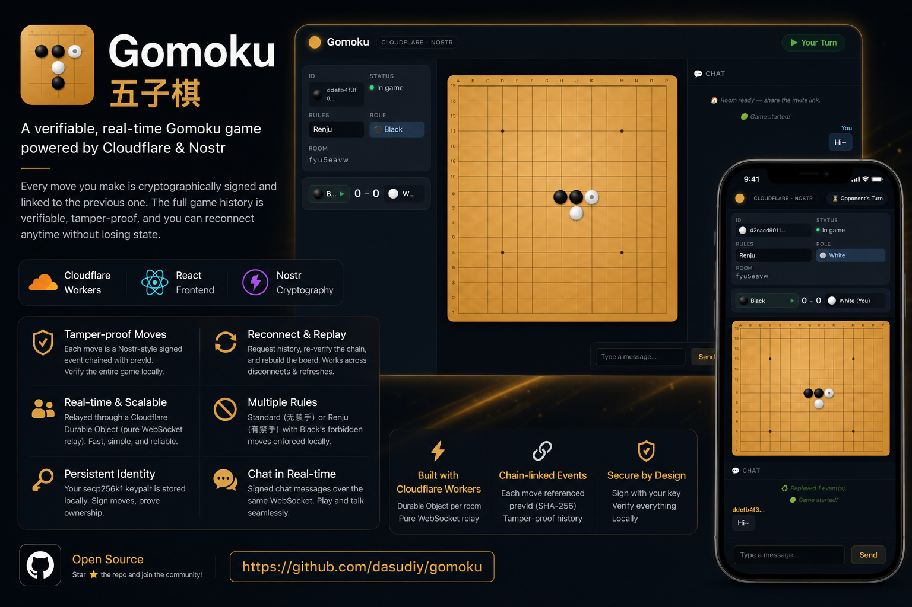

# Gomoku — Online Board Game



A Gomoku (五子棋) game built with **React**, **Cloudflare Workers**, and **Nostr** cryptography. Games are relayed through a Cloudflare Durable Object, with every move cryptographically signed and chained — meaning the full game history is verifiable and players can reconnect after a disconnect without losing state.

## Features

- **Cloudflare Workers backend** — Durable Object per room acting as a **pure WebSocket relay**: broadcasts every message to all other connections. No game logic, no signature verification. Includes built-in safeguards: 64 KB message cap, 20 msg/s per-client rate limit, 10-client room cap, 30-minute idle eviction.
- **Chain-linked moves** — Each move is a [Nostr](https://github.com/nostr-protocol/nostr)-style signed event containing `prevId` (the SHA-256 ID of the previous event). Chain validation is entirely client-side; the server cannot tamper with the game record.
- **Structured game lifecycle** — Room state is encoded in the chain: `genesis` (host creates room + rules) → `accept` (host admits guest) → `move` × N → optional `reset`. Observers can join and watch without affecting gameplay.
- **Reconnect / history replay** — On join or reconnect, the client broadcasts `history_request`; any peer responds with the full event chain. The requester re-verifies every signature and `prevId`, then rebuilds board state. Works transparently for disconnects and page refreshes. A 5-second retry fires until genesis is received.
- **Persistent identity** — A secp256k1 keypair is generated on first visit and stored in `localStorage`. Moves are signed with your private key; the opponent's client verifies them.
- **Game rules**: Standard (无禁手) and Renju (有禁手 — forbidden moves for Black: overline, double-four, double-three).
- **Real-time chat** — Signed chat messages over the same WebSocket.

## Tech Stack

| Layer | Technology |
|---|---|
| Frontend | React 19, TypeScript, Vite |
| Backend | Cloudflare Workers + Durable Objects |
| Crypto / signing | `nostr-tools` (secp256k1 / Schnorr) |
| Styling | Vanilla CSS |

## Project Structure

```
src/           — React frontend
  lib/
    transport.ts   — GameTransport (WebSocket client, auto-reconnect)
    identity.ts    — Keypair generation + Nostr event signing
    game.ts        — Board logic, rule enforcement
  hooks/
    useGameRoom.ts — Room state, chain replay, move dispatch
  components/      — Board, Chat, GameInfo

worker/        — Cloudflare Worker (deploy separately)
  src/index.ts   — GameRoom Durable Object + WebSocket handler
  wrangler.toml  — DO binding
```

## Getting Started

### Prerequisites

- Node.js v20+
- A [Cloudflare account](https://dash.cloudflare.com/sign-up) (free tier is sufficient)

### 1. Deploy the Worker

```bash
cd worker
npm install
npx wrangler login
npx wrangler deploy
```

Note the deployed URL, e.g. `https://gomoku-server.<your-account>.workers.dev`.

### 2. Run the frontend

```bash
# in the repo root
npm install

# point the frontend at your worker
echo "VITE_WORKER_URL=wss://gomoku-server.<your-account>.workers.dev" > .env.local

npm run dev
```

For local end-to-end development, start the worker locally first:

```bash
# terminal 1
cd worker && npx wrangler dev

# terminal 2 (uses wss://localhost:8787 by default when VITE_WORKER_URL is unset)
npm run dev
```

### Production Build

```bash
npm run build   # outputs to dist/
```

## How to Play

1. **Host** — Choose a ruleset, click **Host Game**. A room URL is generated instantly.
2. **Invite** — Copy the link from the sidebar and send it to your opponent.
3. **Join** — The opponent opens the link; both players are assigned colors automatically.
4. **Reconnect** — Either player can refresh the page at any time. The full verified game history is replayed from peers, not the server.

## Move Chain Protocol

Each chain-linked event is a Nostr event (kind `29003`):

```
tags:    [["prev", "<id of previous event>"], ["room", "<roomId>"]]
content: JSON payload  (see chain event types below)
id:      SHA-256 of the canonical serialization (covers tags + content)
sig:     Schnorr signature with the author's private key
```

### Chain event types

| Event | Signed by | Content | Notes |
|---|---|---|---|
| `genesis` | Host | `{ type:"genesis", rules }` | First event, `prev=""` |
| `accept` | Host | `{ type:"accept", opponentPk }` | Records guest pubkey; game starts |
| `move` | Current player | `{ type:"move", x, y }` | Turn derived from chain position |
| `reset` | Either player | `{ type:"reset" }` | New round; wins accumulate |

`genesis.pubkey` = Black (player 1).  `accept.opponentPk` = White (player 2).  
Observers are anyone whose pubkey appears in neither.

### Out-of-chain messages (relayed, not stored in the game record)

| Message | Purpose |
|---|---|
| `join_request` | Guest signals intent to join; host auto-accepts first request |
| `history_request` | New client asks others for the event chain |
| `history_response` | Existing client responds with full chain; requester verifies and replays |
| `chat` | Real-time text for all room participants including observers |

The worker broadcasts every message to all other connections in the room — it has no knowledge of game state, signatures, or chain structure.

## Worker Safeguards

| Limit | Value | Enforcement |
|---|---|---|
| Message size | 64 KB | `close(1009)` |
| Rate limit | 20 msg / s per client | `close(1008)`; state survives hibernation via attachment |
| Max clients | 10 per room | `503 Room full` on upgrade |
| Idle eviction | 30 min without messages | `alarm()` closes all sockets and calls `storage.deleteAll()` |

## Environment Variables

| Variable | Default | Description |
|---|---|---|
| `VITE_WORKER_URL` | `wss://localhost:8787` | WebSocket URL of the deployed Worker |

## License

GPL-3.0 — see [LICENSE](LICENSE).
